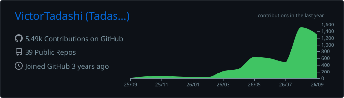
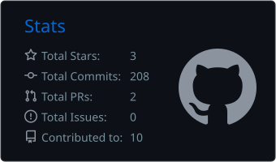
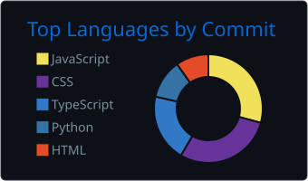

<!-- Banner --> 
<!-- 
  
 
  
 
     

👨🏻‍💻 Sobre mim

Sou Victor Tadashi, desenvolvedor de software em São Paulo, trabalhando na interseção entre desenvolvimento web, ferramentas de IA e sistemas de conteúdo.

💼 Dev Front End AI na Skillplace (plataforma LMS/LXP) — comecei no front-end e hoje atuo também no back-end
🎓 Graduando em Engenharia de Software na FIAP (2025–2028) · Técnico em TI pela FIAP (2023–2024)
🤖 Construindo pipelines modulares de agentes de IA com Claude Code
🎯 Objetivo: me tornar AI Engineer — e, no futuro, aprofundar em Cibersegurança
🧑‍🚀 Também atendo projetos freelance (sites, landing pages e sistemas web)
🔭 No que estou trabalhando
Projeto	Descrição	Stack
Plataforma de Conteúdo Educacional com IA	Pipeline com dois agentes que gera blocos de aprendizagem em JSON estruturado, exportáveis para HTML, PDF e PowerPoint	Lovable · Claude Code · TypeScript
Squads_Claude	Arquitetura de squads/skills reutilizáveis para Claude Code, com factory pattern, convenções compartilhadas e templates	Claude Code · Playwright · APIs
Chat CLI	CLI de chat com streaming, histórico em SQLite e controle de tokens e custo por conversa	Python · Gemini API · SQLite
🚀 Projetos em destaque
Projeto	O que é	Stack
MeetMind	Análise de transcrições de reuniões com IA para a TOTVS: 768 transcrições reais anonimizadas, extração de sinais de negócio (churn, upsell, concorrentes)	Java · IA
Vitalis	Plataforma de telemedicina — Global Solution FIAP (equipe Grasshoppers), com UML e pitch	Java · POO
Task Manager Full Stack	Migração de um app console C# para aplicação web completa com EF Core e documentação via Scalar	React · TypeScript · ASP.NET Core · PostgreSQL
MyFinances	App de finanças pessoais que evoluiu de console para Web API + front-end	ASP.NET Core · SQLite · React
Instagram Carousel Squad	Automação de carrosséis sobre TI/IA: 5 pilares de conteúdo, lógica anti-repetição, export em PNG	Claude Code · Playwright · Pexels API
🌐 Sites em produção
skillplace.com.br — site institucional da Skillplace
fernandobarra.com.br — portfólio profissional
victortadashi.vercel.app — meu portfólio
🛠️ Tecnologias

Linguagens

  

Front-end & Back-end

  

Bancos de dados

  

Ferramentas & Deploy

  

IA & Automação

     

## 📊 Estatísticas

  

  
  

  

 -->

<!-- ===================== BANNER ===================== -->

  

  

  
  
  
  

<!-- 

  

 -->

---

## 👨🏻‍💻 Sobre mim

  

Sou **Victor Tadashi Saito Barra**, desenvolvedor de software em São Paulo. Trabalho na interseção entre **desenvolvimento web, ferramentas de IA e sistemas de conteúdo**, e gosto de transformar ideias em produtos que as pessoas realmente usam.

---

## 🏢 Onde trabalho

  

  

Atuo na **[Skillplace](https://www.skillplace.com.br/)** desde julho de 2025, em modelo híbrido. Comecei no front-end e hoje também trabalho no back-end:

- 🌐 Estrutura do site institucional e conteúdo das landing pages
- ⚙️ APIs em **C# / .NET 8** — como uma API que converte pacotes HTML/imagens em blocos de conteúdo JSON estruturado, com Swagger
- 🤖 Exploração de ferramentas com IA para geração de sites e conteúdo

  

---

## 🧭 Minha jornada

| Quando | Marco |
|:---:|---|
| **2023** | 🎓 Início do Técnico em TI na FIAP |
| **2024** | ✅ Conclusão do técnico · primeiros projetos freelance |
| **2025** | 🎓 Início do bacharelado em Engenharia de Software na FIAP |
| **Jul/2025** | 💼 Entrada na Skillplace como Dev Front End AI |
| **2026** | 🤖 Projetos com IA: MeetMind (TOTVS), pipelines de agentes e plataforma de conteúdo educacional |
| **Próximo** | 🚀 AI Engineer · 🔐 Cibersegurança |

---

## 🔭 No que estou trabalhando

| Projeto | Descrição | Stack |
|---|---|---|
| **Plataforma de Conteúdo Educacional com IA** | Pipeline com dois agentes que gera blocos de aprendizagem em JSON, exportáveis para HTML, PDF e PowerPoint | Lovable · Claude Code · TypeScript |
| **Squads_Claude** | Arquitetura de squads/skills reutilizáveis para Claude Code, com *factory pattern* e templates | Claude Code · Playwright |
| **Chat CLI** | CLI de chat com streaming, histórico em SQLite e controle de tokens e custo | Python · Gemini API · SQLite |

---

## 🚀 Projetos em destaque

| Projeto | O que é | Stack |
|---|---|---|
| **MeetMind** | Análise de transcrições de reuniões com IA para a TOTVS: 768 transcrições reais anonimizadas, extração de sinais de negócio (churn, upsell, concorrentes) | Java · IA |
| **Vitalis** | Plataforma de telemedicina — Global Solution FIAP (equipe Grasshoppers) | Java · POO · UML |
| **Task Manager Full Stack** | Migração de app console C# para aplicação web completa | React · TypeScript · ASP.NET Core · PostgreSQL |
| **MyFinances** | Finanças pessoais: de console para Web API + front-end | ASP.NET Core · SQLite · React |
| **Instagram Carousel Squad** | Automação de carrosséis sobre TI/IA com lógica anti-repetição e export em PNG | Claude Code · Playwright · Pexels API |

### 🌐 Sites em produção

- [skillplace.com.br](https://www.skillplace.com.br/) — site institucional da Skillplace
- [fernandobarra.com.br](https://www.fernandobarra.com.br/) — portfólio profissional
- [victortadashi.vercel.app](https://victortadashi.vercel.app/) — meu portfólio

---

## 💻 Linguagens que falo

  

  

## 🛠️ Stack

**Front-end & Back-end**

  

**Bancos de dados**

  

**Ferramentas & Deploy**

  

**IA & Automação**

  
  
  
  

### 📚 Estudando agora

  
  
  
  
  

---

## 📊 Estatísticas

  

  
  

  

---

## 🐍 Minhas contribuições sendo devoradas

  <picture>
    <source media="(prefers-color-scheme: dark)" srcset="https://raw.githubusercontent.com/VictorTadashi/VictorTadashi/output/github-snake-dark.svg" />
    <source media="(prefers-color-scheme: light)" srcset="https://raw.githubusercontent.com/VictorTadashi/VictorTadashi/output/github-snake.svg" />
    
  </picture>

---

  

